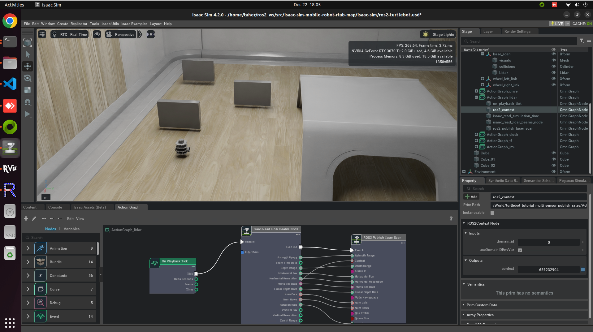
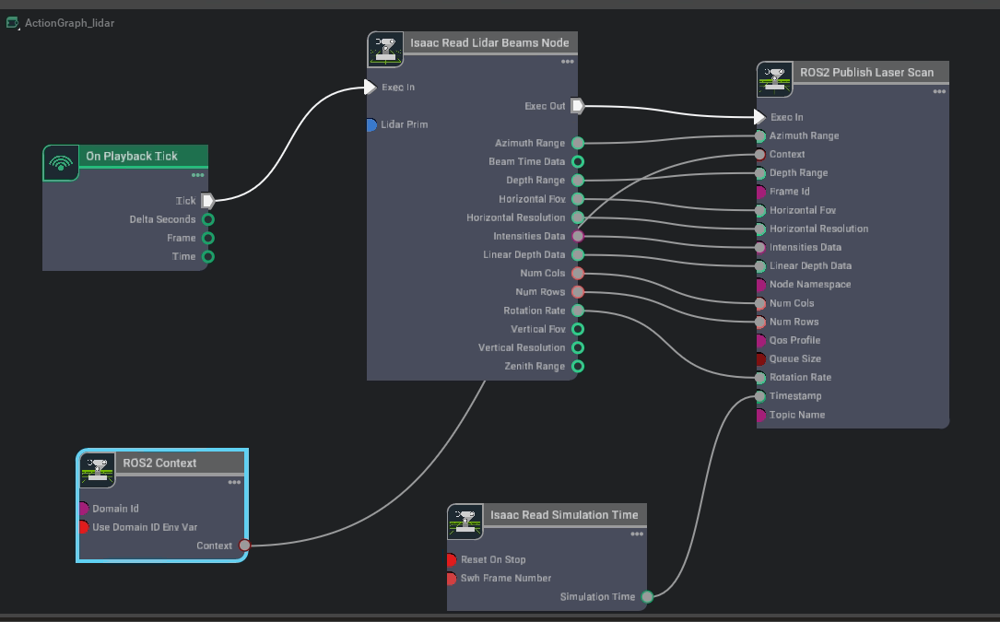

# Isaac Sim + RTAB-Map + Nav2

[](https://github.com/SaurabhKhimesra/SLAM-with-RTAB/actions/workflows/ci.yml)

A TurtleBot3 driving around a small indoor scene in NVIDIA Isaac Sim, mapping with
RTAB-Map and navigating with Nav2. Isaac Sim publishes the sensors, odometry and TF
over the ROS 2 bridge; the launch files here bring up SLAM, the navigation stack and
RViz2 on top of them.

[Demo video](https://youtu.be/MkWIAPUYG_Y)



## Environment

The stage was saved from Isaac Sim 4.2.0, and the launch files target ROS 2 Humble on
Ubuntu 22.04. CI builds them on Humble and Jazzy. Other versions will probably work, but
the topics and frames listed below are what this stage actually publishes.

## Setup

Isaac Sim, with the ROS 2 bridge extension enabled:
<https://docs.omniverse.nvidia.com/isaacsim/latest/>

ROS 2 Humble: <https://docs.ros.org/en/humble/Installation.html>

```bash
sudo apt install ros-humble-rtabmap-ros \
                 ros-humble-navigation2 \
                 ros-humble-nav2-bringup \
                 ros-humble-teleop-twist-keyboard
```

Then build:

```bash
mkdir -p ~/ros2_ws/src && cd ~/ros2_ws/src
git clone https://github.com/SaurabhKhimesra/SLAM-with-RTAB.git isaac_sim_mobile_robot_rtab_map
cd ~/ros2_ws
colcon build --symlink-install
source install/setup.bash
```

## Running it

Four terminals, each with `install/setup.bash` sourced.

**1. Start the simulation.** Either open `isaac-sim/ros2-turtlebot.usd` in the Isaac Sim
GUI and press Play, or let the script do it (`python.sh` lives in your Isaac Sim install
directory):

```bash
./python.sh ~/ros2_ws/src/isaac_sim_mobile_robot_rtab_map/script/run-sim.py
```

**2. RTAB-Map:**

```bash
ros2 launch isaac_sim_mobile_robot_rtab_map rtabmap_scan.launch.py
```

**3. Nav2:**

```bash
ros2 launch isaac_sim_mobile_robot_rtab_map navigation2.launch.py
```

**4. RViz2:**

```bash
ros2 launch isaac_sim_mobile_robot_rtab_map rviz.launch.py
```

Once `/map` and the costmaps appear in RViz2, send the robot somewhere with **2D Goal
Pose**. To drive it by hand instead:

```bash
ros2 run teleop_twist_keyboard teleop_twist_keyboard
```

## What the stage publishes

The robot prim carries five OmniGraphs, one per concern. The lidar one is pictured
below: `On Playback Tick` drives `Isaac Read Lidar Beams`, whose output feeds
`ROS2 Publish Laser Scan`, with the stamp coming from `Isaac Read Simulation Time`.



| ActionGraph | ROS 2 interface |
| --- | --- |
| `ActionGraph_drive` | subscribes `/cmd_vel`, through a differential controller into the articulation |
| `ActionGraph_lidar` | publishes `/scan`, frame `base_scan` |
| `ActionGraph_clock` | publishes `/clock` |
| `ActionGraph_tf` | publishes `/odom` and `/tf` |
| `ActionGraph_imu` | publishes `/imu` |

Because time comes from `/clock`, everything downstream needs `use_sim_time:=true`.

## TF tree

`view_frames` output from a mapping run ([PDF](images/tf_frames.pdf)):


RTAB-Map publishes `map -> odom` at roughly 22 Hz. Isaac Sim publishes `odom -> base_link`
and the sensor frames at 60 Hz.

## What the launch files do

They are thin wrappers around the stock demos rather than custom bringup:

- `rtabmap_scan.launch.py` includes `turtlebot3_scan.launch.py` from `rtabmap_demos`
- `navigation2.launch.py` includes `navigation_launch.py` from `nav2_bringup`
- `rviz.launch.py` includes `rviz_launch.py` from `nav2_bringup`

The first two take a `use_sim_time` argument (default `true`) and pass it down.
`nav2_bringup`'s RViz launch does not declare one, so that wrapper takes no arguments.

## Layout

```
launch/
  rtabmap_scan.launch.py     RTAB-Map SLAM against /scan
  navigation2.launch.py      Nav2 bringup
  rviz.launch.py             RViz2 with the Nav2 displays
isaac-sim/
  ros2-turtlebot.usd         the stage, including the five ActionGraphs
script/
  run-sim.py                 opens the stage and steps the simulation
images/
```

## Troubleshooting

**`FileNotFoundError` from `rtabmap_scan.launch.py`.** `rtabmap_demos` moved its demos
into per-robot subfolders in December 2024, so `turtlebot3_scan.launch.py` now lives under
`launch/turtlebot3/`. The launch file searches for it either way — if it still comes up
empty, `ros-humble-rtabmap-ros` is not installed.

**No map.** Check the scan is actually arriving with `ros2 topic hz /scan`. The bridge
only ticks while the simulation is playing, so a paused stage publishes nothing.

**Everything is stuck at time zero.** Something was launched without `use_sim_time`.
Confirm with `ros2 param get /rtabmap use_sim_time`.

**`Could not transform from map`.** RTAB-Map is what publishes `map -> odom`, so it needs
to be up and receiving scans before Nav2 can plan.

**Nodes cannot see each other.** `ROS_DOMAIN_ID` has to match in every terminal, and Isaac
Sim reads it when it starts, not when you press Play.

## References

- [Isaac Sim](https://developer.nvidia.com/isaac/sim) and its
  [ROS 2 bridge](https://docs.omniverse.nvidia.com/isaacsim/latest/)
- [RTAB-Map](https://introlab.github.io/rtabmap/) and
  [rtabmap_ros](https://github.com/introlab/rtabmap_ros/tree/ros2#rtabmap_ros)
- [Nav2](https://docs.nav2.org/)
- [tf2](https://docs.ros.org/en/humble/Tutorials/Intermediate/Tf2/Introduction-To-Tf2.html)

## Credits

This project builds on [`taherfattahi/isaac-sim-mobile-robot-rtab-map`](https://github.com/taherfattahi/isaac-sim-mobile-robot-rtab-map)
by Taher Fattahi. The Isaac Sim stage (`ros2-turtlebot.usd`) and the five ActionGraphs
inside it, the original launch wrappers and `run-sim.py`, and the ActionGraph and
`view_frames` captures in `images/` are his work. What I added on top is the ROS 2
packaging (snake_case package name, declared runtime dependencies), a fix for the
`rtabmap_demos` launch path after upstream moved its demos into per-robot subfolders,
`use_sim_time` plumbed through the wrappers, CI on Humble and Jazzy, and the
documentation of the topics, frames and TF tree the stage actually publishes. The
[demo video](https://youtu.be/MkWIAPUYG_Y) is my own run of it.

## Licence

MIT — see [LICENSE](LICENSE).
